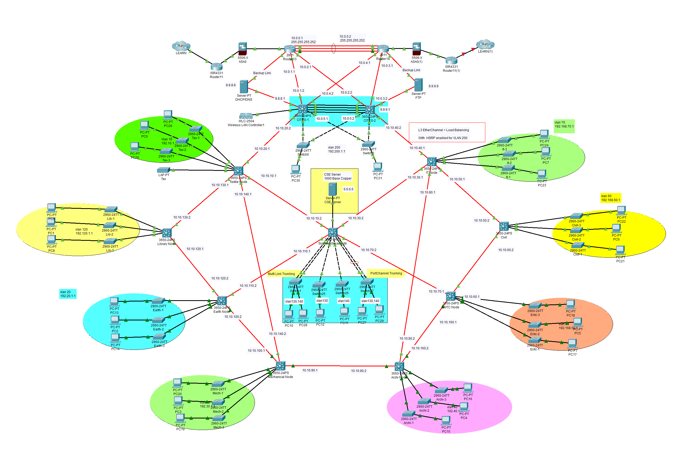
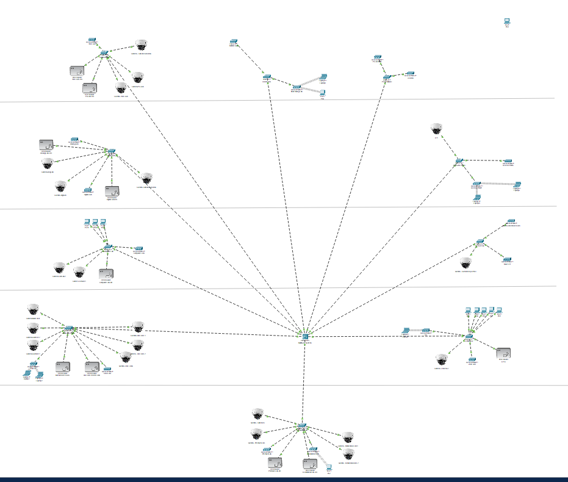
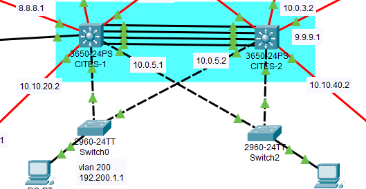

# Local Area Network Design - University of Moratuwa

## 📋 Project Overview

This project presents the comprehensive design of a Local Area Network (LAN) infrastructure for the University of Moratuwa (UoM), including both the university backbone network and the internal network for the Department of Electronic and Telecommunication Engineering (ENTC).

**Team: Network Simulation Team - Notwork**

### 👥 Group Members
- **220212A** HAPUARACHCHI HADND
- **220221B** HATHURUSINGHA HAR  
- **220325X** KODITHUWAKKU T N
- **220115E** DHARMADASA M A A K

## 🎯 Project Objectives

### University Backbone Network
- Design a high-speed, reliable, and secure backbone network connecting multiple university buildings
- Implement redundancy and disaster recovery mechanisms
- Ensure scalability for 20-25 years of operation
- Handle peak traffic loads up to 1.38 Gbps from LEARN connectivity

### ENTC Department Network  
- Create a secure, scalable, and cost-effective internal network
- Support laboratory equipment, workstations, and security devices
- Implement VLAN segmentation for different user groups
- Integrate wireless access points and security systems (CCTV, RFID door locks)

## 🏗️ Network Architecture

### Backbone Network Design
- **Topology:** Ring topology with 9 Layer 3 switch nodes
- **Primary Links:** 10 Gbps single-mode fiber
- **Backup Links:** 1 Gbps multi-mode fiber for disaster recovery
- **Routing Protocol:** OSPF (Open Shortest Path First)
- **Redundancy:** HSRP (Hot Standby Router Protocol) implementation



### ENTC Network Design
- **Topology:** Hierarchical star topology
- **Core Switch:** Cisco Catalyst 3650-24 (Layer 3)
- **Access Switches:** Cisco Catalyst 2960-24TT (Layer 2)
- **Wireless Infrastructure:** Centrally managed access points
- **Security Integration:** Dedicated VLANs for CCTV and RFID systems



## 🔧 Technical Specifications

### Key Network Components
- **Layer 3 Switches:** Cisco Catalyst 3650 Series (11 units for backbone)
- **Layer 2 Switches:** Cisco Catalyst 2960-24TT (31 units total)
- **Routers:** Cisco 2811 and ISR4331 models
- **Wireless Controller:** Cisco 2504 WLC
- **Servers:** 3 Enterprise servers for various services

### Network Services
- **DHCP:** Centralized IP address management across all VLANs
- **DNS:** Domain name resolution services
- **FTP:** File transfer services (files.mrt.ac.lk)
- **Email:** Complete email infrastructure
- **RADIUS:** Centralized authentication for wireless access
- **Wireless Management:** Cisco WLC for access point control

### VLAN Configuration
The ENTC network implements 24 VLANs for different purposes:
- **VLANs 10-135:** General user devices (17 VLANs)
- **VLAN 200:** RFID Door Locks (Static IP assignment)
- **VLAN 220:** CCTV Cameras (Static IP assignment)

## 🔒 Security Features

- **VLAN Segmentation:** Isolated network segments for different user types
- **RADIUS Authentication:** Centralized wireless access control
- **Static IP Assignment:** For critical security devices (cameras, door locks)
- **Access Control:** Managed through Cisco WLC
- **Network Monitoring:** Integrated CCTV system on dedicated VLAN

### HSRP Redundancy Configuration
The backbone network implements Hot Standby Router Protocol (HSRP) for high availability:



- **Active Router Priority:** 150 (192.200.1.2)
- **Standby Router Priority:** 100 (192.200.1.3) 
- **Virtual IP:** 192.200.1.1
- **Hello Timer:** 3 seconds
- **Hold Timer:** 10 seconds

## 📊 Performance Metrics

### Bandwidth Utilization
- **LEARN Connection:** 1.5 Gbps capacity
- **Peak Usage:** 1.38 Gbps (92% utilization)
- **Critical Need:** Efficient inter-VLAN routing to manage internal traffic

### Network Capacity
- **Each VLAN:** Supports up to 251 users
- **DHCP Pools:** Configured for optimal IP address distribution
- **Routing Efficiency:** OSPF metrics ensure optimal path selection

## 🛠️ Simulation Environment

**Note:** This design was implemented and tested using Cisco Packet Tracer. The hardware models used are older generation devices due to simulator limitations, but the design principles apply to modern equipment.

### Simulation Results
✅ DHCP successfully configured for all VLANs  
✅ Devices receive correct IP addresses and gateways  
✅ Inter-VLAN routing operational  
✅ Successful ping tests between VLANs  
✅ Wireless devices can access internet via access points  
✅ OSPF routing tables populated correctly  
✅ HSRP redundancy functional  

## 📁 Repository Structure

```
├── Design Report.pdf          # Complete project documentation
├── README.md                 # This file
├── images/                   # Network topology diagrams
│   ├── hsrp-configuration.png    # HSRP redundancy setup
│   ├── entc-network-topology.png # ENTC department network design
│   └── university-backbone.png   # Complete university backbone network
├── Configuration Files/      # Router and switch configurations
├── Simulation Files/         # Packet Tracer project files
└── Documentation/           # Additional technical documentation
```

## 🚀 Future Enhancements

### Scalability Considerations
- Design supports 20-25 year operational lifetime
- Modular architecture allows easy expansion
- VLAN structure accommodates growth
- Fiber infrastructure ready for higher speeds

### Technology Upgrades
- Migration path to newer Cisco hardware
- Support for 10G SFP+ connections in production
- Integration with modern network management systems
- Enhanced security features implementation

## ⚠️ Important Notes

- **Hardware Obsolescence:** Simulated devices are end-of-life; production implementation requires current-generation equipment
- **Pricing Disclaimer:** Listed prices are indicative only due to hardware obsolescence
- **Packet Tracer Limitations:** Some advanced features (10G SFP+) cannot be fully simulated

## 🤝 Contributing

This project was developed as part of academic coursework. For questions or discussions about the network design:

1. Review the complete design report
2. Examine network diagrams and configurations  
3. Consider scalability and security requirements
4. Evaluate cost-effectiveness of proposed solutions

## 📞 Contact

For technical inquiries regarding this network design project, please contact the development team through the University of Moratuwa, Department of Electronic & Telecommunication Engineering.

---

**Disclaimer:** This network design was created for educational purposes as part of the EN2150 course requirements. Implementation in production environments should involve thorough security assessments and updated hardware selections.
